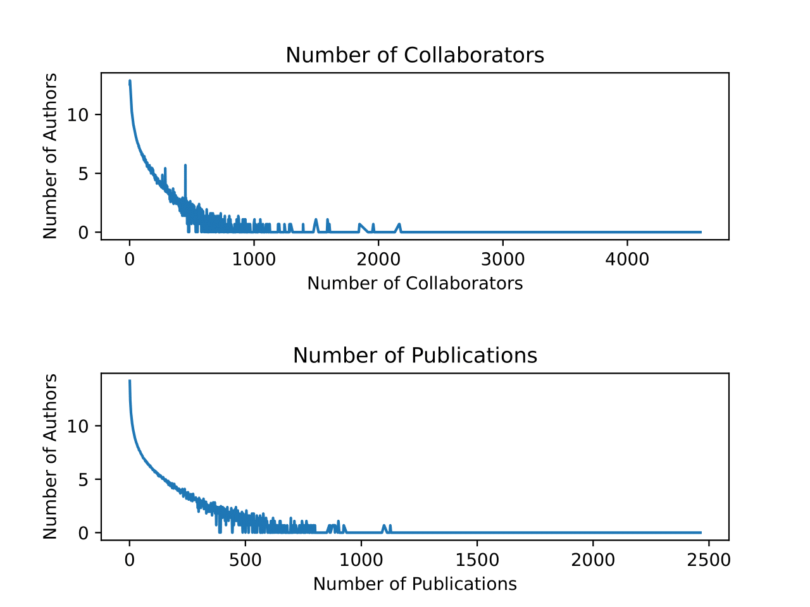

# Data-Analytics-Pipeline
**Objectives**: To get familiar with the main components of the data analytic pipeline: schema design, data acquisition, data transformation, and querying.

Files provided: [wrapper.py](https://github.com/kpal002/Data-Analytics-Pipelinne/blob/main/wrapper.py), [dblp.dtd](https://github.com/kpal002/Data-Analytics-Pipelinne/blob/main/dblp.dtd) and [createRawSchema.sql](https://github.com/kpal002/Data-Analytics-Pipelinne/blob/main/createRawSchema.sql)

Assignment tools: postgres, excel (or some other tool for visualization)

Motivation: In this homework you will implement a basic data analysis pipeline: data acquisition, transformation and extraction, cleaning, analysis and sharing of results. The data is [DBLP](https://dblp.uni-trier.de/db/), the reference citation website created and maintained by Michael Ley. 

**Resources:**

1. postgres, MYSQL, or SQLLite
2. starter code


## **Problem 1: Conceptual Design**

Design and create a database schema about publications. We will refer to this schema as **PubSchema**, and to the data as **PubData**. 

E/R Diagram. Design the E/R diagram, consisting of the entity sets and relationships below. Draw the E/R diagram for this schema, identify all keys in all entity sets, and indicate the correct type of all relationships (many-many or many-one); make sure you use the ISA box where needed.

1. Author has attributes: _id_ (a key; must be unique), _name_, and _homepage_(a URL)
2. Publication has attributes: _pubid_ (the key -- an integer), _pubkey_ (an alternative key, text; must be unique), _title_, and _year_. It has the following subclasses: \
  a. Article has additional attributes: _journal_, _month_, _volume_, _number_ \
  b. Book has additional attributes: _publisher_, _isbn_ \
  c. Incollection has additional attributes: _booktitle_, _publisher_, _isbn_ \
  d. Inproceedings has additional attributes: _booktitle_, _editor_

3. There is a many-many relationship Authored from Author to Publication 


## **Problem 2: Schema Design**

In this part we create the SQL tables in a database like postgres, MYSQL, or SQLLite. First, check that you have installed postgres (or another db) on your computer. Then, create an empty database by running the following commands (sample commands for SQLLite):


````
$ psql dblp
````
All the queries for creating tables are written in [createPubSchema.sql](https://github.com/kpal002/Data-Analytics-Pipelinne/blob/main/createPubSchema.sql). To run from the command line, run

````
$ psql -f createPubSchema.sql dblp
````
## **Problem 3: Data Acquisition**

Typically, this step consists of downloading data, or extracting it with a software tool, or inputting it manually, or all of the above. Then it involves writing and running some python script, called a wrapper that reformats the data into some CSV format that we can upload to the database.

Download the DBLP data [dblp.dtd](https://github.com/kpal002/Data-Analytics-Pipelinne/blob/main/dblp.dtd) and _dblp.xml.gz_ from the [dblp](https://dblp.uni-trier.de/xml/) website, then unzip the xml file. Make sure you understand what data the the big xml file contains: look inside by running:
````
more dblp.xml
````
Then run:
````
python wrapper.py
````
This will take several minutes, and produces two large files: _pubFile.txt_ and _fieldFile.txt_. Finally run
````
psql -f createRawSchema.sql dblp
````

This creates two tables, _Pub_ and _Field_, then imports the data (which may take a few minutes). We will call these two tables _RawSchema_ and _RawData_ respectively.

## **Problem 4: Querying the Raw Data**

During typical data ingestion, we sometimes need to discover the true schema of the data, and for that we need to query the _RawData_.

Start psql then type the following commands:

````
select * from Pub limit 50;
select * from Field limit 50;
````
For example, if we go to the [dblp](https://dblp.uni-trier.de/db/) website , check out this paper, search for Henry M. Levy, look for the "Vanish" paper, and export the entry in BibTeX format. We should see the following in your browser
````
@inproceedings{DBLP:conf/uss/GeambasuKLL09,
  author    = {Roxana Geambasu and
               Tadayoshi Kohno and
               Amit A. Levy and
               Henry M. Levy},
  title     = {Vanish: Increasing Data Privacy with Self-Destructing Data},
  booktitle = {18th {USENIX} Security Symposium, Montreal, Canada, August 10-14,
               2009, Proceedings},
  pages     = {299--316},
  year      = {2009},
  crossref  = {DBLP:conf/uss/2009},
  url       = {http://www.usenix.org/events/sec09/tech/full_papers/geambasu.pdf},
  timestamp = {Thu, 15 May 2014 18:36:21 +0200},
  biburl    = {http://dblp.org/rec/bib/conf/uss/GeambasuKLL09},
  bibsource = {dblp computer science bibliography, http://dblp.org}
}
````
The key of this entry is _conf/uss/GeambasuKLL09_. We can try to get the same info by running the following SQL query:

````
select * from Pub p, Field f where p.k='conf/uss/GeambasuKLL09' and f.k='conf/uss/GeambasuKLL09'
````
````
           k            |       p       |           k            | i  |     p     |                                v                                 
------------------------+---------------+------------------------+----+-----------+------------------------------------------------------------------
 conf/uss/GeambasuKLL09 | inproceedings | conf/uss/GeambasuKLL09 | 0  | author    | Roxana Geambasu
 conf/uss/GeambasuKLL09 | inproceedings | conf/uss/GeambasuKLL09 | 1  | author    | Tadayoshi Kohno
 conf/uss/GeambasuKLL09 | inproceedings | conf/uss/GeambasuKLL09 | 2  | author    | Amit A. Levy
 conf/uss/GeambasuKLL09 | inproceedings | conf/uss/GeambasuKLL09 | 3  | author    | Henry M. Levy
 conf/uss/GeambasuKLL09 | inproceedings | conf/uss/GeambasuKLL09 | 4  | title     | Vanish: Increasing Data Privacy with Self-Destructing Data.
 conf/uss/GeambasuKLL09 | inproceedings | conf/uss/GeambasuKLL09 | 5  | pages     | 299-316
 conf/uss/GeambasuKLL09 | inproceedings | conf/uss/GeambasuKLL09 | 6  | year      | 2009
 conf/uss/GeambasuKLL09 | inproceedings | conf/uss/GeambasuKLL09 | 7  | booktitle | USENIX Security Symposium
 conf/uss/GeambasuKLL09 | inproceedings | conf/uss/GeambasuKLL09 | 8  | ee        | http://www.usenix.org/events/sec09/tech/full_papers/geambasu.pdf
  | conf/uss/2009
  | db/conf/uss/uss2009.html#GeambasuKLL09
(11 rows)
````
Write SQL Queries to answer the following questions using _RawSchema_:

1. For each type of publication, count the total number of publications of that type. Your query should return a set of (publication-type, count) pairs. For example (article, 20000), (inproceedings, 30000), ... (not the real answer).
````
SELECT p AS PublicationType, COUNT(k)
        FROM Pub
        GROUP BY p;
        
        
        publicationtype |  count  
-----------------+---------
 article         | 2860157
 book            |   19408
 incollection    |   68035
 inproceedings   | 3035079
 mastersthesis   |      13
 phdthesis       |   87188
 proceedings     |   50938
 www             | 3004514
(8 rows)

````
2. We say that a field occurs in a publication type, if there exists at least one publication of that type having that field. For example, _publisher_ occurs in _incollection_, but _publisher_ does not occur in _inproceedings_. Find the fields that occur in all publications types. Your query should return a set of field names: for example it may return title, if title occurs in all publication types (article, inproceedings, etc. notice that title does not have to occur in every publication instance, only in some instance of every type), but it should not return publisher (since the latter does not occur in any publication of type inproceedings).

````
SELECT f.p, COUNT(DISTINCT p.p)
	FROM Pub p INNER JOIN Field f ON p.k = f.k
	GROUP BY f.p
	HAVING COUNT(DISTINCT p.p) >= 8;


   p    | count 
--------+-------
 author |     8
 ee     |     8
 note   |     8
 title  |     8
 year   |     8
(5 rows)

````

3. The two queries above may be slow. Speed them up by creating appropriate indexes, using the CREATE INDEX statement. You also need indexes on Pub and Field for the next question; create all indices you need on RawSchema

````
CREATE INDEX PubKey ON Pub(k);
CREATE INDEX PubP ON Pub(p);

CREATE INDEX FieldKey ON Field(k);
CREATE INDEX FieldP ON Field(p);
CREATE INDEX FieldV ON Field(v);

````
All the queries are listed in _solution.sql_

## **Problem 5: Data Transformation**

In this part, we will transform the DBLP data from _RawSchema_ to _PubSchema_. This step is sometimes done using an ETL tool, but we will just use several SQL queries. We need to write queries to populate the tables in _PubSchema_. 

The RawSchema and PubSchema are quite different, so there is a need to go through some trial and error to get the transformation right. Here are a few hints:

1. Create temporary tables (and indices) to speedup the data transformation. Remember to drop all your temp tables when you are done

2. It is very inefficient to bulk insert into a table that contains a key and/or foreign keys (why?); to speed up, you may drop the key/foreign key constraints, perform the bulk insertion, then alter Table to create the constraints.

3. PubSchema requires an integer key for each author and each publication. Use a sequence in postgres.
4. DBLP knows the Homepage of some authors, and you need to store these in the Author table. But where do you find homepages in _RawData_? DBLP uses a hack. Some publications of type _www_ are not publications, but instead represent homepages. 
5. What if a publication in RawData has two titles? Or two publishers? Or two years? (You will encounter duplicate fields, but not necessarily these ones.) You may pick any of them, but you need to work a little to write this in SQL.

[importPubData.sql](https://github.com/kpal002/Data-Analytics-Pipelinne/blob/main/importPubData.sql) contains all the insert, create Table, alter Table, etc statements.
## **Problem 6: Run Data Analytic Queries**

Write SQL queries to answer the following questions:

1. Find the top 20 authors with the largest number of publications. (Runtime: under 10s)

````
WITH tmpAuth AS (SELECT AuthorID, COUNT(PubID) AS NumPublications
                                FROM Authored
                                GROUP BY AuthorID
                                ORDER BY NumPublications DESC
                                LIMIT 20)
SELECT a.AuthorID, Name, NumPublications
        FROM Author AS a INNER JOIN tmpAuth ON a.AuthorID = tmpAuth.AuthorID;
	
Time: 2238.800 ms (00:02.239)
````

Find the top 20 authors with the largest number of publications in STOC. Repeat this for two more conferences, of your choice. Suggestions: top 20 authors in SOSP, or CHI, or SIGMOD, or SIGGRAPH; note that you need to do some digging to find out how DBLP spells the name of your conference. (Runtime: under 10s.)

````
create view conference as (select pubid, booktitle
		from Incollection) union (select pubid, booktitle
		from Inproceedings);

create view STOC as (select aed.AuthorID, count(*) as cnt
	from conference c left outer join Authored aed on c.pubid=aed.pubid
	where c.booktitle like '%STOC%' or c.booktitle like '%symposium of theory of computing%'
	group by aed.AuthorID
);

select * from STOC order by cnt desc limit 20;

Time: 8034.558 ms (00:08.035)
````

````
create view SIGMOD as (select aed.AuthorID, count(*) as cnt
	from conference c left outer join Authored aed on c.pubid=aed.pubid
	where c.booktitle like '%SIGMOD%' or c.booktitle like '%special interest group on management of data%'
	group by aed.AuthorID
);
select * from SIGMOD order by cnt desc limit 20;

Time: 7469.679 ms (00:07.470)
````

````
create view PODS as (select aed.AuthorId, count(*) as cnt
	from conference c left outer join Authored aed on c.pubid=aed.pubid
	where c.booktitle like '%PODS%'
	group by aed.AuthorID
);
select * from PODS order by cnt desc limit 20;

Time: 7687.022 ms (00:07.687)
````
3. The two major database conferences are 'PODS' (theory) and 'SIGMOD Conference' (systems). Find

(a). all authors who published at least 10 SIGMOD papers but never published a PODS paper, and

````
SELECT ts.AuthorID, a.Name, ts.cnt as NumPublications       
        FROM PODS AS tp 
                FULL OUTER JOIN SIGMOD AS ts ON tp.AuthorID = ts.AuthorID
                LEFT OUTER JOIN Author AS a ON ts.AuthorID = a.AuthorID
        WHERE tp.cnt IS NULL AND ts.cnt >= 10
        ORDER BY ts.cnt DESC;
	
Time: 15711.447 ms (00:15.711)
````
(b). all authors who published at least 5 PODS papers but never published a SIGMOD paper. (Runtime: under 10s)

````
SELECT tp.AuthorID, a.Name, tp.cnt as NumPublications
        FROM PODS AS tp 
                FULL OUTER JOIN SIGMOD AS ts ON tp.AuthorID = ts.AuthorID
                LEFT OUTER JOIN Author AS a ON tp.AuthorID = a.AuthorID
        WHERE tp.cnt >= 5 AND ts.cnt IS NULL
        ORDER BY tp.cnt DESC;
	
Time: 15170.231 ms (00:15.170)

drop view SIGMOD;
drop view PODS;
````

4. A decade is a sequence of ten consecutive years, e.g. 1982, 1983, ..., 1991. For each decade, compute the total number of publications in DBLP in that decade. Hint: for this and the next query you may want to compute a temporary table with all distinct years. (Runtime: under 1minute.)

````
select y.year as Startyear, sum(z.num)
from numPubYear y, numPubYear z
where z.year >= y.year and z.year < y.year+10
group by y.year
order by y.year;

Time: 0.809 ms

drop table numPubYear;
````
5. Find the top 20 most collaborative authors. That is, for each author determine its number of collaborators, then find the top 20. Hint: for this and some question below you may want to compute a temporary table of coauthors. (Runtime: a couple of minutes.)

````
with CoAuthor as (select a1.AuthorId as id1, a2.AuthorID as id2
		from Authored a1 inner join Authored a2 on a1.pubid = a2.pubid
		where not a1.AuthorID = a2.AuthorID)
select id1 as id, count(DISTINCT(id2)) as NumCollaborators
from CoAuthor
group by id1
order by NumCollaborators desc limit 20;

Time: 36946.446 ms (00:36.946)
````
6. For each decade, find the most prolific author in that decade. Hint: you may want to first compute a temporary table, storing for each decade and each author the number of publications of that author in that decade. Runtime: a few minutes.

````
CREATE TABLE tempYearAuthor (
		Year INT,
		AuthorID INT,
		NumPublications INT
		);

-- Time: 10.574 ms
INSERT INTO tempYearAuthor (
		SELECT CAST(p.Year AS INT), ad.AuthorID, COUNT(PubKey)
			FROM Publication AS p INNER JOIN Authored AS ad ON p.PubID = ad.PubID
			WHERE p.Year IS NOT NULL
			GROUP BY p.Year, ad.AuthorID);

-- Time: 36291.731 ms (00:36.292)
WITH tmp AS (SELECT t1.Year AS StartYear, t1.AuthorID, SUM(t2.NumPublications) AS TotalNum
				FROM tempYearAuthor AS t1 
					INNER JOIN tempYearAuthor AS t2 ON t1.AuthorID = t2.AuthorID
				WHERE t1.Year <= t2.Year AND 
					  t2.Year < t1.Year + 10 AND
					  t1.Year <= 2008
				GROUP BY t1.Year, t1.AuthorID)
SELECT StartYear, AuthorID
	FROM tmp
	WHERE (StartYear, TotalNum) IN (SELECT StartYear, MAX(TotalNum)
										   	   FROM tmp
										   	   GROUP BY StartYear);

DROP TABLE tempYearAuthor;

Time: 7705.587 ms (00:07.706)
````

7. Find the institutions that have published most papers in STOC; return the top 20 institutions. Then repeat this query with your favorite conference (SOSP or CHI, or ...), and see which are the best places and you didn't know about. Hint: where do you get information about institutions? Use the Homepage information: convert a Homepage like http://www.cs.ucr.edu/msalloum to http://www.cs.ucr.edu; now you have grouped all authors from our department, and we use this URL as surrogate for the institution. Read about substring manipulation in postres, by looking up _substring_, _position_, and _trim_.

````
create table Num(n int);
-- Time: 0.233 ms
insert into Num values(1);
-- Time: 0.296 ms
insert into Num(values(2));
-- Time: 0.264 ms
insert into Num(values(3));
-- Time: 0.247 ms
create table Inst(id int, inst text);

insert into Inst(
	with Url as (select a.AuthorID as id, split_part(a.homepage, '/', n.n) as url
		from Author a, Num n)
	select id, url
	from (select ROW_NUMBER() over (partition by id) as r, id, url
		from Url
		where not url='' and not url='http:' and not url='https:') as rs
	where r=1);

-- Time: 2826.545 ms (00:02.827)

select i.inst, sum(s.cnt) as tot_cnt
from Inst i inner join STOC s on i.id=s.AuthorId
group by i.inst
order by tot_cnt desc limit 20;

Time: 7482.111 ms (00:07.482)


select i.inst, sum(s.cnt) as tot_cnt
from Inst i inner join STOC s on i.id=s.AuthorId
group by i.inst
order by tot_cnt desc limit 20;

Time: 7890.348 ms (00:07.890)

drop table Num;
drop table Inst;
drop view STOC;
drop view conference;
````
All the above queries are included in [solution.sql](https://github.com/kpal002/Data-Analytics-Pipelinne/blob/main/solution.sql)
## **Problem 7: Data Visualization**

create some histograms (graphs), by writing a python script that first runs a query, then produces a graph using the result of the query.

Construct two histograms: the histogram of the number of collaborators, and the histogram of the number of publications. The first histograph will have these axes:
1. the X axis is a number X=1,2,3,...
2. the Y axis represents the number of authors with X collaborators: Y(0)= number of authors with 0 collaborators, Y(1) = number of authors with 1 collaborator, etc

Similarly for the second histogram. Try using a log scale, or a log-log scale, and choose the most appropriate. Feel free to produce a very nice graph (not necessarily a histogram).


The code for this part is included in [graph.py](https://github.com/kpal002/Data-Analytics-Pipelinne/blob/main/graph.py)

