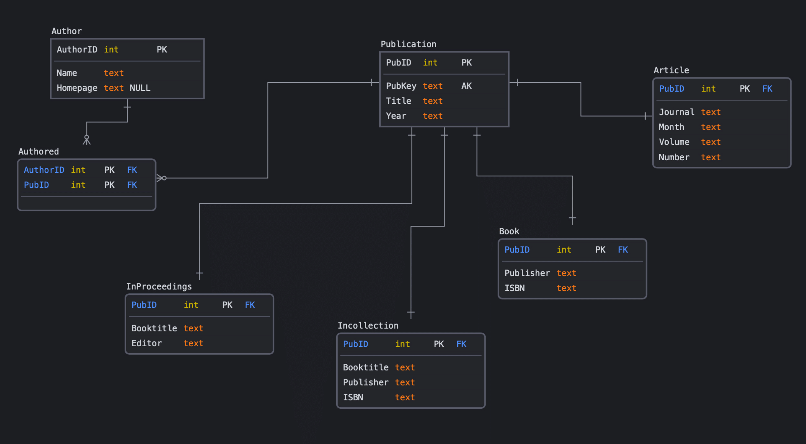

# Data-Analytics-Pipeline
**Objectives**: To get familiar with the main components of the data analytic pipeline: schema design, data acquisition, data transformation, and querying.

Files provided: [wrapper.py](https://github.com/kpal002/Data-Analytics-Pipelinne/blob/main/wrapper.py), [dblp.dtd](https://github.com/kpal002/Data-Analytics-Pipelinne/blob/main/dblp.dtd) and [createRawSchema.sql](https://github.com/kpal002/Data-Analytics-Pipelinne/blob/main/createRawSchema.sql)

Assignment tools: postgres, excel (or some other tool for visualization)

Motivation: In this homework you will implement a basic data analysis pipeline: data acquisition, transformation and extraction, cleaning, analysis and sharing of results. The data is [DBLP](https://dblp.uni-trier.de/db/), the reference citation website created and maintained by Michael Ley. 

**Resources:**

1. postgres, MYSQL, or SQLLite
2. starter code


## **Problem 1: Conceptual Design**

Design and create a database schema about publications. We will refer to this schema as **PubSchema**, and to the data as **PubData**. 

E/R Diagram. Design the E/R diagram, consisting of the entity sets and relationships below. Draw the E/R diagram for this schema, identify all keys in all entity sets, and indicate the correct type of all relationships (many-many or many-one); make sure you use the ISA box where needed.

1. Author has attributes: _id_ (a key; must be unique), _name_, and _homepage_(a URL)
2. Publication has attributes: _pubid_ (the key -- an integer), _pubkey_ (an alternative key, text; must be unique), _title_, and _year_. It has the following subclasses: \
  a. Article has additional attributes: _journal_, _month_, _volume_, _number_ \
  b. Book has additional attributes: _publisher_, _isbn_ \
  c. Incollection has additional attributes: _booktitle_, _publisher_, _isbn_ \
  d. Inproceedings has additional attributes: _booktitle_, _editor_

3. There is a many-many relationship Authored from Author to Publication 



## **Problem 2: Schema Design**

In this part we create the SQL tables in a database like postgres, MYSQL, or SQLLite. First, check that you have installed postgres (or another db) on your computer. Then, create an empty database by running the following commands (sample commands for SQLLite):


````
$ psql dblp
````
All the commands for creating tables are written in [createPubSchema.sql](https://github.com/kpal002/Data-Analytics-Pipelinne/blob/main/createPubSchema.sql). To run from the command line, run

````
$ psql -f createPubSchema.sql dblp
````
## **Problem 3: Data Acquisition**

Typically, this step consists of downloading data, or extracting it with a software tool, or inputting it manually, or all of the above. Then it involves writing and running some python script, called a wrapper that reformats the data into some CSV format that we can upload to the database.

Download the DBLP data [dblp.dtd](https://github.com/kpal002/Data-Analytics-Pipelinne/blob/main/dblp.dtd) and _dblp.xml.gz_ from the [dblp](https://dblp.uni-trier.de/xml/) website, then unzip the xml file. Make sure you understand what data the the big xml file contains: look inside by running:
````
more dblp.xml
````
Then run:
````
python wrapper.py
````
This will take several minutes, and produces two large files: _pubFile.txt_ and _fieldFile.txt_. Finally run
````
psql -f createRawSchema.sql dblp
````

This creates two tables, _Pub_ and _Field_, then imports the data (which may take a few minutes). We will call these two tables _RawSchema_ and _RawData_ respectively.

## **Problem 4: Querying the Raw Data**

During typical data ingestion, we sometimes need to discover the true schema of the data, and for that we need to query the _RawData_.

Start psql then type the following commands:

````
select * from Pub limit 50;
select * from Field limit 50;
````
